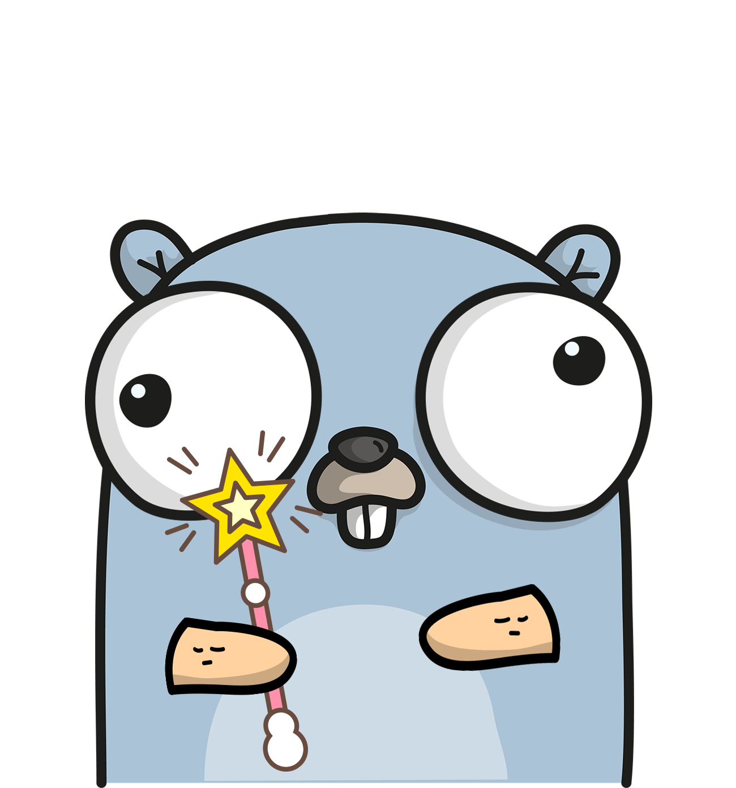

<p align="center"></p>


[](https://goreportcard.com/report/github.com/psampaz/gothanks)

Give thanks (in the form of a GitHub ★) to your fellow Go modules maintainers. 

# About

GoThanks performs the following operations

- Sends a star to Go's repo (github.com/golang.go)
- Reads your go.mod file and sends a star to every Github repository that your app/library depends on

This is a simple way to say thanks to the maintainers of the modules you use and the contributors of Go itself.

# Credits

GoThanks is a Go port of symfony/thanks implemented by Nicolas Grekas (nicolas-grekas) for PHP.

Original idea by Doug Tangren (softprops) for Rust.

# Installation

```go
$ go get -u github.com/psampaz/gothanks
```

# Usage

In order to run GoThanks you need to have a valid [Github Access Token](https://help.github.com/en/github/authenticating-to-github/creating-a-personal-access-token-for-the-command-line). 

You can pass the token as an argument to GoThanks or store it in an environmental variable named GITHUB_TOKEN.

Inside the folder where your go.mod lives run:

```go
$ ./gothanks -github-token=xxxxxx
```

or 

```go
$ export GITHUB_TOKEN=xxxxx
$ ./gothanks
```
# Example

```go
$ ./gothanks
Welcome to GoThanks :)

You are about to star you beloved dependencies.

Press y to continue or n to abort
y

Sending your love..

Repository github.com/golang/go is already starred!
Repository github.com/golang/net is already starred!
Sending a star to github.com/google/go-github
Sending a star to github.com/stretchr/testify
Sending a star to github.com/sirupsen/logrus

Thank you!
```
